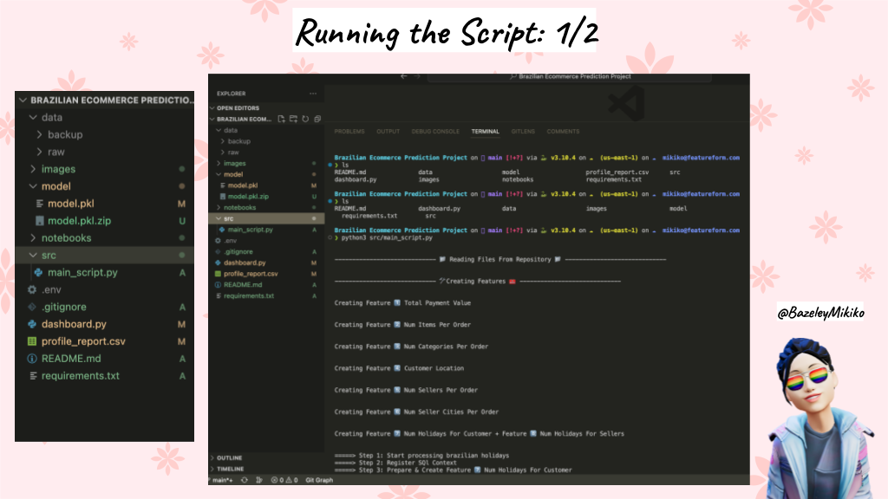
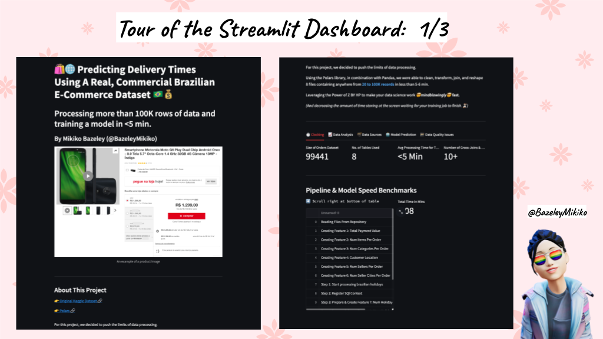
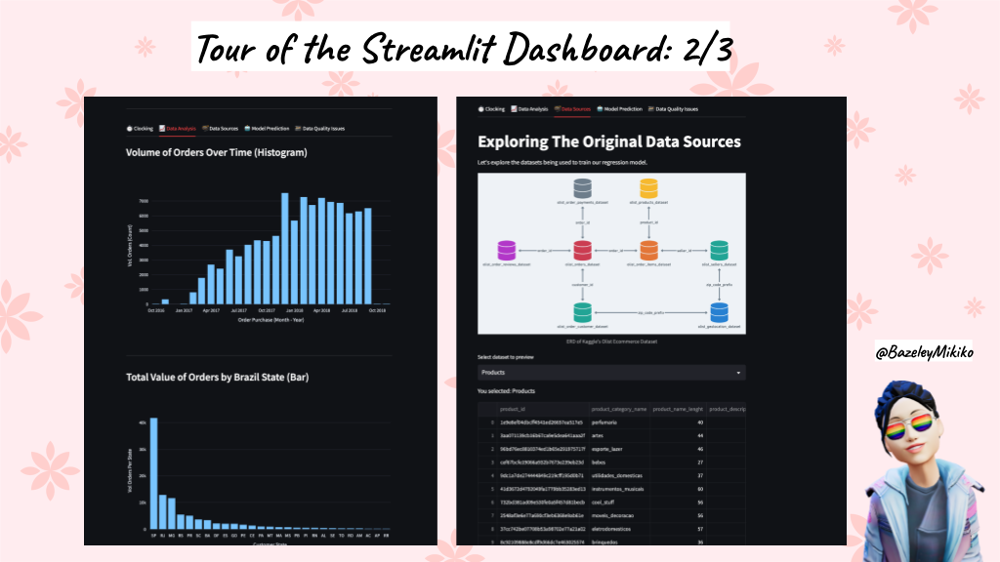
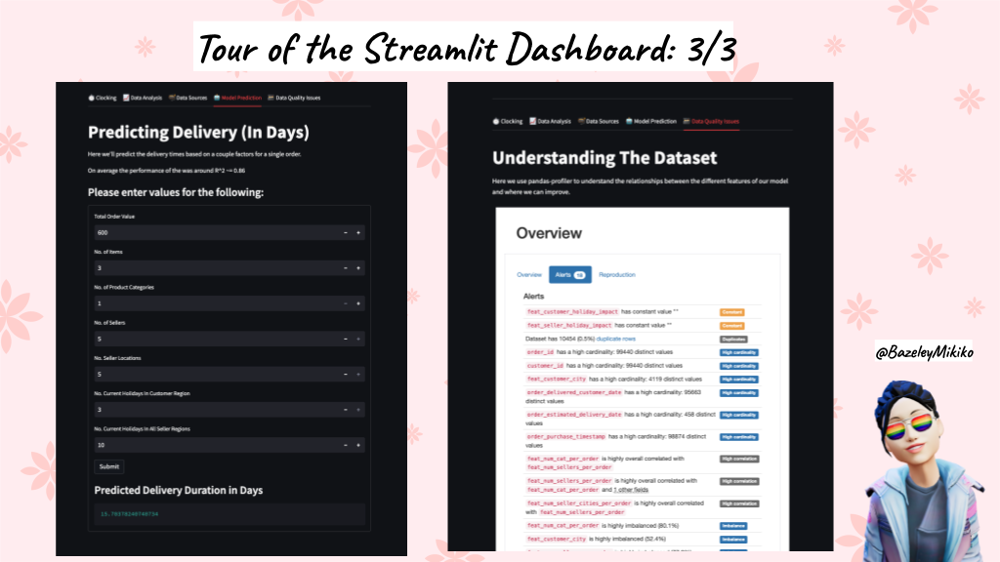

# 🛍️🌐 Predicting Delivery Times Using A Real, Commercial Brazilian E-Commerce Dataset 🇧🇷💰
==============================

In this project, we develop a regression model to predict how long it'll take for an order to be delivered for using the Olist Ecommerce Dataset available on Kaggle. 

# Summary
* [👉 Original Kaggle Dataset 🔗](https://www.kaggle.com/datasets/olistbr/brazilian-ecommerce/)
* [👉 Polars 🔗](https://www.pola.rs/)

For this project, we decided to push the limits of data processing.

Using the Polars library, in combination with Pandas, we were able to clean, transform, join, and reshape 8 files containing anywhere from **[20 to 100K records]**  in less than 5-6 min. 

Leveraging the Power of Z BY HP to make your data science work **_🤯mindblowingly🤯_ fast**.

_(And decreasing the amount of time staring at the screen waiting for your training job to finish.⏳)_

------------  

# Instructions
1. Clone this Git repository using the following command: `git clone https://github.com/MMBazel/Kaggle-Brazilian-Ecommerce-Prediction.git`
1. Using the terminal or command prompt, `cd` into `Kaggle-Brazilian-Ecommerce-Prediction`
1. Check if you have Python installed on your machine by typing `python --version` in your terminal or command prompt window. If Python is not installed, download and install Python from the official website.
1. Create a virtual environment for the project using the following command:
    * `python -m venv <YOUR_ENV_NAME>`
1. Activate the virtual environment using the following command:
    * On Windows: 
        * If you're using command line: `<YOUR_ENV_NAME>\Scripts\activate.bat`
        * If you're using PowerShell: `<YOUR_ENV_NAME>\Scripts\Activate.ps1`
    * On Linux/Mac: source `<YOUR_ENV_NAME>/bin/activate`
1. Install the required packages using pip by running the following command:
    * `pip install -r requirements.txt`
1. Manually (or programatically) unzip the different data sources in `/data/raw/` and `/data/backup/`.
1. Make sure you're in the root folder. In your terminal run the command:
    * `python3 src/main_script.py`
1. If the program has run successfully, a streamlit dashboard should open in a browser window.
1. When you're finished, hit `Ctrl+C` to exit streamlit. 
    
------------  

# Project Organization

    ├── README.md          <- The top-level README for developers using this project.
    ├── data
    │   ├── raw       <- Data needed for the pipeline. Make sure everything has been unzipped. 
    │   └── backup            <- Backup files for the Streamlit dashboard. Makesure they're unzipped. 
    │
    ├── models             <- Trained and serialized models, model predictions, or model summaries
    │
    ├── notebooks          <- Jupyter notebooks. Naming convention is a number (for ordering),
    │                         the creator's initials, and a short `-` delimited description, e.g.
    │                         `1.0-jqp-initial-data-exploration`.
    │
    ├── requirements.txt   <- The requirements file for reproducing the analysis environment, e.g.
    │                         generated with `pip freeze > requirements.txt`
    │
    ├── src                <- Source code for use in this project.
    │   │
    │   └── main_script.py  <- The only script that needs to be run with `python3 src/main_script.py`.
    │                          Make sure you're in the right folder. 
    ├── dashboard.py          <- Script for the Streamlit dashboard.
    
------------
# Running The Script
## 📹 Video 📹
   * 👉 Watch my screenshare of the Streamlit dashboard running here:[`YOUTOUBE VIDEO HERE: Brazilian Ecommerce: Running The Script - Part 1`](https://youtu.be/wSyZj8goszQ)
   * 👉 Watch my screenshare of the Streamlit dashboard running here:[`YOUTOUBE VIDEO HERE: Brazilian Ecommerce: Running The Script - Part 2`](https://youtu.be/Zu6l_GHz_S4)
    
## Screenshots

------------
# Playing With The Dashboard
## 📹 Video 📹
  * 👉 Watch my screenshare of the Streamlit dashboard running here:[`YOUTOUBE VIDEO HERE: Dashboard - Tour of Brazilian Ecommerce Prediction Streamlit Dashboard`](https://youtu.be/eGr4MxSCsrA)
    
## Screenshots

